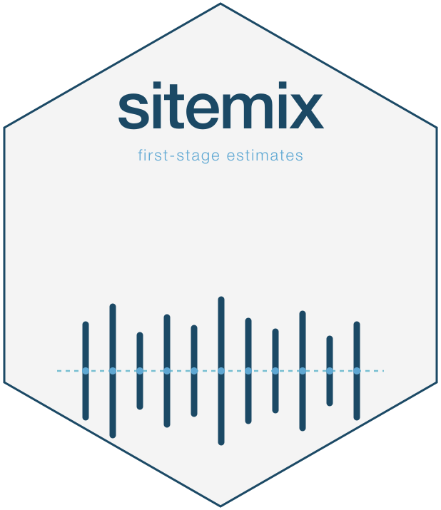

<!-- README.md is generated from README.Rmd. Please edit that file. -->

# sitemix 

<!-- badges: start -->

[](https://lifecycle.r-lib.org/articles/stages.html)
[](https://opensource.org/licenses/MIT)
<!-- [](https://github.com/joonho112/sitemix/actions/workflows/R-CMD-check.yaml) -->
<!-- [](https://github.com/joonho112/sitemix/actions/workflows/pkgdown.yaml) -->
<!-- [](https://app.codecov.io/gh/joonho112/sitemix) -->
<!-- badges: end -->

**A proportion or rate reported for each site is only as trustworthy as
the sampling uncertainty behind it.** `sitemix` computes **site- and
group-level proportions, rates, and sampling uncertainty** from student
rows, sufficient counts, or published aggregates. It returns a
package-neutral `sitemix_estimates` tibble with point estimates,
standard errors, provenance, and optional joint covariance for
downstream analysis.

## Five-minute example

``` r
library(sitemix)
data(prek_sim, package = "sitemix")
```

Produce one-indicator site-level estimates for the 2024 cohort of the
bundled simulated pre-K panel:

``` r
est <- sm_estimate(
  subset(prek_sim, year == 2024),
  family    = "binomial",
  indicator = "frpm"
)
head(est, 5)
#> sitemix_estimates: 5 rows x 18 columns | family=binomial | role=summary_uncertainty
#> groups=5 sites=5 years=1 indicators=1 V=FALSE K=FALSE
#> # A tibble: 5 × 18
#>   site_id  year indicator theta_raw theta_hat se_raw    se     n n_eff
#>   <chr>   <int> <chr>         <dbl>     <dbl>  <dbl> <dbl> <int> <dbl>
#> 1 S001     2024 frpm          0.111     0.340  0.105 0.167     9     9
#> 2 S002     2024 frpm          0.8       1.11   0.126 0.158    10    10
#> 3 S003     2024 frpm          0.5       0.785  0.177 0.177     8     8
#> 4 S004     2024 frpm          0.429     0.714  0.132 0.134    14    14
#> 5 S005     2024 frpm          0.875     1.21   0.117 0.177     8     8
#> # ℹ 9 more variables: estimate_scale <chr>, transform <chr>, var_method <chr>,
#> #   flag_small_n <lgl>, flag_zero_cell <lgl>, input_mode <chr>,
#> #   flag_suppressed <lgl>, framing <chr>, flag_below_accountability <lgl>
```

You now have a `sitemix_estimates` tibble with one row per
site-year-indicator. Audit it with
[`sm_diagnose()`](https://joonho112.github.io/sitemix/reference/sm_diagnose.html),
then use the ID columns with `theta_hat` and `se` (or validated grouped
`V`) in downstream work.

## What you can do with sitemix

Use `sm_estimate()` for student rows, `sm_estimate_from_counts()` for
sufficient counts, and `sm_estimate_from_aggregates()` for published
aggregate rows. The wrappers are the recommended count and aggregate
interfaces because they lock the input path. Direct `from_counts` /
`from_aggregates` flags and `vjt` remain supported; no current public
argument is deprecated in v0.2.

| Scenario | Input | Function |
|:---|:---|:---|
| **A** binomial | one binary indicator; student rows or sufficient counts | `sm_estimate()` / `sm_estimate_from_counts()` |
| **B** multivariate | overlapping binary indicators; student rows or complete marginal + pairwise counts | `sm_estimate(family = "multivariate")` / `sm_estimate_from_counts(family = "multivariate")` |
| **C** multinomial | mutually exclusive categories; student rows or complete category counts | `sm_estimate(family = "multinomial")` / `sm_estimate_from_counts(family = "multinomial")` |
| **D0** aggregate binomial | one numerator/denominator per site-year | `sm_estimate_from_aggregates()` |
| **D1** aggregate marginal | multiple marginals per site-year with working independence | `sm_estimate_from_aggregates(family = "multivariate")` |

Published aggregate marginals do not identify a multinomial composition:
`sm_estimate_from_aggregates(family = "multinomial")` is rejected rather
than silently routed to D1. Across all supported inputs,
`anscombe = TRUE` requires `vst = "arcsine"`.

Plus diagnostics
([`sm_diagnose()`](https://joonho112.github.io/sitemix/reference/sm_diagnose.html)),
suppression auditing
([`sm_suppression_report()`](https://joonho112.github.io/sitemix/reference/sm_suppression_report.html)),
variance smoothing
([`sm_smooth_variance()`](https://joonho112.github.io/sitemix/reference/sm_smooth_variance.html)),
formal raw pairwise Fréchet intervals and non-bound projected stress
scenarios for unidentified D1 covariance
([`sm_frechet_envelope()`](https://joonho112.github.io/sitemix/reference/sm_frechet_envelope.html)).

## Installation

You can install the development version of sitemix from GitHub:

``` r
# install.packages("pak")
pak::pak("joonho112/sitemix")
```

The package depends on R (≥ 4.1.0) and a small set of tidyverse-
adjacent packages (`rlang`, `tibble`, `vctrs`, `cli`, `Matrix`). The
optional `mgcv` package is loaded on demand for GAM smoothing.

## Where to read next

The documentation is organized into two tracks: **applied** guides are
workflow-first; **methodological** articles give the derivations.

### Applied track

| Article | What it covers |
|:---|:---|
| [A1 · Getting started](https://joonho112.github.io/sitemix/articles/a1-getting-started.html) | your first site-level estimate in about five minutes |
| [A2 · Input formats](https://joonho112.github.io/sitemix/articles/a2-input-formats.html) | choose the entry function for student rows, counts, or aggregates |
| [A3 · Scenario A — binomial](https://joonho112.github.io/sitemix/articles/a3-scenario-binomial.html) | boundary methods and reporting transforms |
| [A4 · Scenarios B / C](https://joonho112.github.io/sitemix/articles/a4-multivariate-multinomial.html) | overlapping-indicator and multinomial covariance |
| [A5 · Published aggregates D0 / D1](https://joonho112.github.io/sitemix/articles/a5-published-aggregates.html) | publisher CSVs, subgroup pivots, and suppression |
| [A6 · Diagnostics and suppression](https://joonho112.github.io/sitemix/articles/a6-diagnostics-and-suppression.html) | audit an estimates tibble before downstream use |
| [A7 · Variance smoothing and Fréchet](https://joonho112.github.io/sitemix/articles/a7-variance-smoothing-and-frechet.html) | opt-in experimental sensitivity tools |
| [A8 · Downstream workflows](https://joonho112.github.io/sitemix/articles/a8-downstream-workflows.html) | package-neutral scalar / split / joint-covariance export |
| [A9 · Case study — end-to-end workflow](https://joonho112.github.io/sitemix/articles/a9-case-study-end-to-end.html) | an end-to-end project from data to downstream-ready uncertainty |

### Methodological track

| Article | What it covers |
|:---|:---|
| [M1 · Statistical foundations](https://joonho112.github.io/sitemix/articles/m1-statistical-foundations.html) | the design-based sampling model and locked notation |
| [M2 · Scalar SE — binomial](https://joonho112.github.io/sitemix/articles/m2-scalar-se-binomial.html) | the closed-form delta-method SE and the exact count-vs-rows equivalence identity |
| [M3 · Multivariate SUR covariance](https://joonho112.github.io/sitemix/articles/m3-multivariate-sur-covariance.html) | Scenario B cross-indicator covariance |
| [M4 · Multinomial simplex](https://joonho112.github.io/sitemix/articles/m4-multinomial-simplex.html) | Scenario C full-simplex covariance |
| [M5 · Aggregate engines D0 / D1](https://joonho112.github.io/sitemix/articles/m5-aggregate-engines.html) | published-aggregate estimation and non-identification |
| [M6 · Variance smoothing theory](https://joonho112.github.io/sitemix/articles/m6-variance-smoothing-theory.html) | the GVF smoother and its fixed-seed NO-GO simulation |
| [M7 · Fréchet envelope theory](https://joonho112.github.io/sitemix/articles/m7-frechet-envelope-theory.html) | Fréchet–Hoeffding bounds and projected stress scenarios |
| [M8 · Output contract](https://joonho112.github.io/sitemix/articles/m8-output-contract.html) | the package-neutral output contract |

## Migrating to v0.3.0

| v0.2.0 surface | v0.3.0 contract |
|:---|:---|
| `alprek_subset` | Renamed to `prek_sim`, a fully simulated panel generated from design constants in `inst/scripts/build-prek-sim.R` |
| `alprek_subset.csv`, `alprek_subset_counts.rds` | `prek_sim.csv`, `prek_sim_counts.rds` in `inst/extdata/` |
| `alprek_subset_provenance.txt` | `prek_sim_design.txt`, recording the generative model instead of a source identity |

## Migrating to v0.2.0

| v0.1 surface | v0.2.0 contract |
|:---|:---|
| Optional `ebrecipe` dependency | Removed; no replacement consumer package is required |
| `as_eb_input()` | Retired; select IDs, canonical estimates/SEs, provenance, and validated grouped `V` directly |
| `sitemix_role = "eb_handoff"` | Replaced by `sitemix_role = "summary_uncertainty"` |
| Adapter-readiness diagnostics | Replaced by intrinsic scalar, covariance, scale, suppression, and sensitivity facts |

Consumer-specific conversion belongs in the downstream project. Diagnose
an output before selecting rows or covariance groups, and keep raw- and
reported-scale estimates paired with uncertainty on the same scale.

## Current limitations

- Supported estimands are site- and group-level proportions and rates,
  not arbitrary summary statistics.
- Published D1 marginals do not identify their dependence structure.
  Working independence and projected stress scenarios remain explicitly
  labeled.
- Variance smoothing is experimental, opt-in, and append-only; the
  fixed-seed audit did not support promoting it to the canonical
  default.
- Suppression-sensitivity rows are audit scenarios, not ordinary
  identified estimates, and cannot enter ordinary covariance or Fréchet
  calculations.

## Status

`sitemix` v0.3.0 is under release-candidate review and remains
unreleased. The Scenarios A / B / C / D0 / D1 estimators, diagnostics,
pivots, smoothing helpers, and covariance tools are implemented and
tested. API names and edge-case behavior may evolve before v1.0; v0.3.0
renamed the bundled example data from `alprek_subset` to the fully
simulated `prek_sim`. See the [release
notes](https://joonho112.github.io/sitemix/news/index.html) for
migration details and the complete change history.

## License

MIT © 2026 JoonHo Lee. See the [license
text](https://joonho112.github.io/sitemix/LICENSE-text.html).

## Citation

Run `citation("sitemix")` in R for the canonical citation. A BibTeX
record is also available at `vignettes/references.bib` under the key
`lee_2026_sitemix`.

## Maintainer

JoonHo Lee — [`jlee296@ua.edu`](mailto:jlee296@ua.edu) · ORCID
[0009-0006-4019-8703](https://orcid.org/0009-0006-4019-8703) · GitHub
[@joonho112](https://github.com/joonho112)
