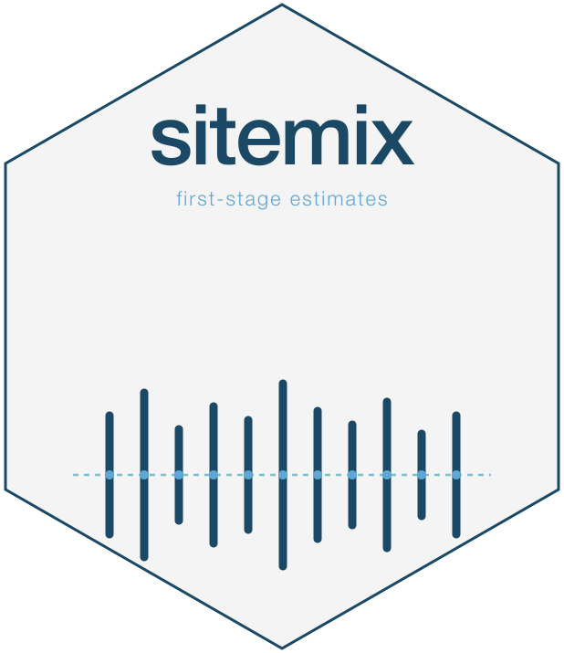

<!-- README.md is generated from README.Rmd. Please edit that file. -->

# sitemix 

<!-- badges: start -->

[](https://lifecycle.r-lib.org/articles/stages.html)
[](https://opensource.org/licenses/MIT)
<!-- badges: end -->

`sitemix` estimates proportions and their sampling uncertainty for sites
and groups over time. Give it student records, sufficient counts, or
published aggregates. It returns a `sitemix_estimates` tibble with point
estimates, standard errors, information about the calculation, and
optional covariance matrices.

## Installation

Install from the package’s GitHub repository:

``` r
# install.packages("pak")
pak::pak("joonho112/sitemix")
```

The package requires R 4.1.0 or later. GAM variance smoothing also
requires the optional `mgcv` package.

## Estimate a proportion at each site

This example uses `prek_sim`, a fully simulated pre-kindergarten panel.
It contains no real children or programs. Select the 2024 records and
estimate the proportion receiving free and reduced-price meals (FRPM):

``` r
library(sitemix)
data(prek_sim, package = "sitemix")
```

``` r
est <- sm_estimate(
  subset(prek_sim, year == 2024),
  family    = "binomial",
  indicator = "frpm"
)
print(
  as.data.frame(est[
    1:5,
    c("site_id", "n", "theta_raw", "se_raw", "theta_hat", "se", "estimate_scale")
  ]),
  row.names = FALSE
)
#>  site_id  n theta_raw    se_raw theta_hat        se estimate_scale
#>     S001  9 0.1111111 0.1047566 0.3398369 0.1666667        arcsine
#>     S002 10 0.8000000 0.1264911 1.1071487 0.1581139        arcsine
#>     S003  8 0.5000000 0.1767767 0.7853982 0.1767767        arcsine
#>     S004 14 0.4285714 0.1322600 0.7137244 0.1336306        arcsine
#>     S005  8 0.8750000 0.1169268 1.2094292 0.1767767        arcsine
```

There are 50 rows, one per site for this year and indicator. `n` counts
students with non-missing FRPM status. `theta_raw` is the observed
proportion and `se_raw` is its raw-scale standard error.

By default, `theta_hat = asin(sqrt(theta_raw))` and `se` is a working
standard error on that arcsine scale, recorded in `estimate_scale`. Use
`theta_raw` to report proportions; keep each point estimate with the
standard error on the same scale. Use `vst = "none"` when you want
`theta_hat` and `se` on the raw scale too.

Check the estimates before using them in another analysis:

``` r
checks <- sm_diagnose(est, verbose = FALSE)
print(
  as.data.frame(checks[c(
    "scalar_uncertainty_finite", "scalar_se_positive", "indicator_scale_consistent"
  )]),
  row.names = FALSE
)
#>  scalar_uncertainty_finite scalar_se_positive indicator_scale_consistent
#>                       TRUE               TRUE                       TRUE
```

These checks are true for this example. Inspect sample-size and boundary
flags for your own data. A zero sampling SE can be correct for a census,
so row selection also depends on the analysis you plan to fit. See
[Getting started with site-level
proportions](https://joonho112.github.io/sitemix/articles/a1-getting-started.html)
for the full walkthrough.

## Choose the input and indicator structure

Use `sm_estimate()` for student rows, `sm_estimate_from_counts()` for
sufficient counts, and `sm_estimate_from_aggregates()` for published
aggregates. The wrappers set the input path for you. The direct
`from_counts`, `from_aggregates`, and `vjt` arguments remain supported.

Choose `family = "binomial"` for one binary indicator, `"multivariate"`
for overlapping binary indicators, or `"multinomial"` for mutually
exclusive categories. Sufficient multivariate counts need the marginal
and pairwise counts; multinomial counts need all categories. Set
`vjt = TRUE` to request within-site covariance. For sufficient
multivariate counts, covariance is supported for at most three
indicators; student-level input also supports larger sets. Its
`vcov_scale` can differ from the reported scalar scale, so inspect it
before using `V`.

The aggregate wrapper supports a single binary indicator (D0) or
multiple binary marginals (D1). It rejects `family = "multinomial"`.
Published D1 marginals do not identify cross-indicator dependence: the
returned diagonal covariance uses a working-independence assumption.

Across supported inputs, `anscombe = TRUE` requires `vst = "arcsine"`.
The package estimates binary and count-based categorical proportions; it
does not summarize arbitrary continuous outcomes. The [function
reference](https://joonho112.github.io/sitemix/reference/index.html)
describes each input’s additional conditions.

## Where to read next

- [Choosing an input
  format](https://joonho112.github.io/sitemix/articles/a2-input-formats.html)
  explains student records, sufficient counts, and publisher files.
- [Checking estimates and handling suppressed
  data](https://joonho112.github.io/sitemix/articles/a6-diagnostics-and-suppression.html)
  explains diagnostics, reporting flags, and suppression summaries.
- [Using estimates and covariance matrices in further
  analyses](https://joonho112.github.io/sitemix/articles/a8-downstream-workflows.html)
  shows how to select and save compatible estimates and uncertainty.

The [article
index](https://joonho112.github.io/sitemix/articles/index.html) includes
the remaining examples and the statistical methods behind them.

Optional [variance smoothing and Fréchet sensitivity
analysis](https://joonho112.github.io/sitemix/articles/a7-variance-smoothing-and-frechet.html)
serve different purposes. `sm_smooth_variance()` fits alternative SEs;
it is experimental, adds columns by default, and does not guarantee an
improvement. `sm_frechet_envelope()` returns formal raw pairwise
intervals only under its D1a conditions and labels projected matrices as
stress scenarios. Suppression-sensitivity rows remain hypothetical
scenarios; they cannot enter ordinary covariance or Fréchet
calculations.

## Migrating to v0.3.0

| v0.2.0 | v0.3.0 |
|:---|:---|
| `alprek_subset` | Renamed to `prek_sim`, a fully simulated panel generated from design constants in `inst/scripts/build-prek-sim.R` |
| `alprek_subset.csv`, `alprek_subset_counts.rds` | `prek_sim.csv`, `prek_sim_counts.rds` in `inst/extdata/` |
| `alprek_subset_provenance.txt` | `prek_sim_design.txt`, describing how the simulated data are generated |

## Migrating to v0.2.0

| v0.1 | v0.2.0 |
|:---|:---|
| Optional `ebrecipe` dependency | Removed; no replacement consumer package is required |
| `as_eb_input()` | Retired; select IDs, estimates and matching SEs, calculation details, and validated grouped `V` directly |
| `sitemix_role = "eb_handoff"` | Replaced by `sitemix_role = "summary_uncertainty"` |
| Adapter-readiness diagnostics | Replaced by checks on estimates, covariance, scales, suppression, and sensitivity |

Prepare any model-specific conversion in the project that fits the
model.

## Status

`sitemix` 0.3.1 contains the correctness fixes described in NEWS.md. See
the GitHub repository for public release availability. API names and
behavior may evolve before v1.0. See the [release
notes](https://joonho112.github.io/sitemix/news/index.html) for
migration details and the complete change history.

## License

MIT © 2026 JoonHo Lee. See the [license
text](https://joonho112.github.io/sitemix/LICENSE-text.html).

## Citation

Run `citation("sitemix")` in R for the package citation. A BibTeX record
is also available at `vignettes/references.bib` under the key
`lee_2026_sitemix`.

## Maintainer

JoonHo Lee — [`jlee296@ua.edu`](mailto:jlee296@ua.edu) · ORCID
[0009-0006-4019-8703](https://orcid.org/0009-0006-4019-8703) · GitHub
[@joonho112](https://github.com/joonho112)
